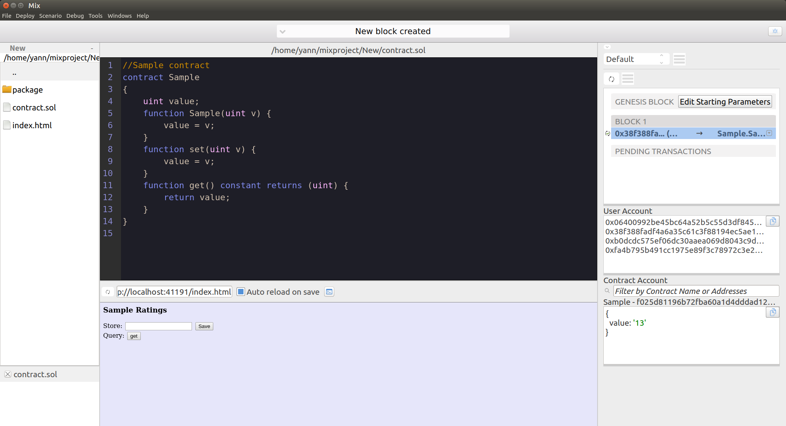

# Mix

The Mix Ethereum Dapp Development Tool

Mix is an IDE that allows developers to build and deploy contracts and decentralized applications on top of the Ethereum blockchain.

it includes:

  - Source code editor for Solidity (contract - backend) and HTML/JS (frontend)
  - Solidity source code debugger
  - Blockchain editor
  - Internal RPC server (allows debugging transactions/calls created from the web3 JavaScript API)
  - Dapp/Contract deployment (deploying to test or live chain)

Download binaries:
    https://github.com/ethereum/mix/releases
    
Build from source:
    https://github.com/ethereum/webthree-umbrella/wiki

